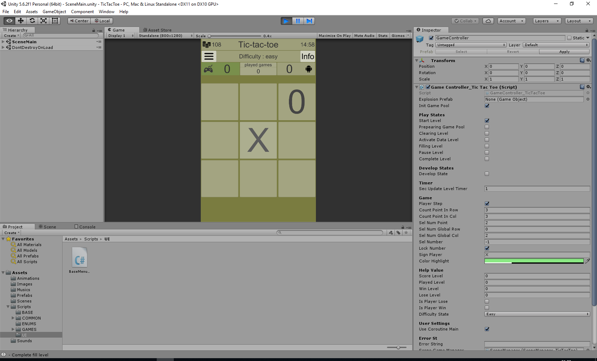

# Tic-Tac-Toe (2D, Unity User Interface)

## Task:
In the test task it is necessary to implement the game "Tic-tac-toe" (tic-tac-toe):
- The project must have a minimum of two scenes, a menu and a game scene;
- in the menu scene there should be a choice of complexity (easy, medium, invincible);
- in the game scene, the 3x3 field on which the game is played. Current account (wins, losses, draws). Opportunity
 to return to the menu scene;
- at the end of the round there should be a pop-up window with the result of the round (who won);
- after the end of the round, the winner goes first (cross). In the case of a tie, the first person who walks the
 second in the previous round;
- Provide different screen aspect ratios. The screen orientation is at the discretion of the developer.
The project must be written in c #, unity.

## Implemented:
All 

## Unity 5.6.2

